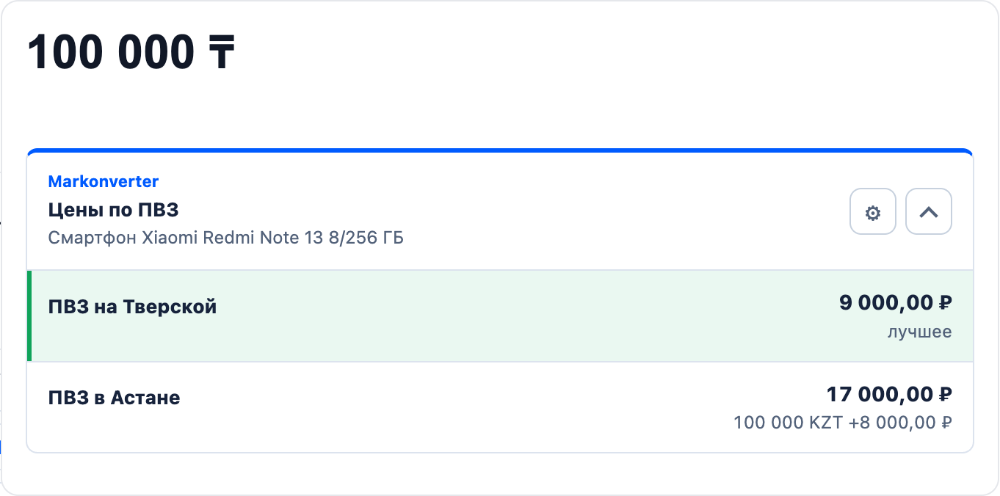

<div align="center">


# Markonverter

**Compare an Ozon product's price across all your saved pickup points — right on the product page.**

[](../LICENSE.md)
[](../src/entrypoints/)
[](#load-in-chrome)
[](../tsconfig.json)

[What it does](#what-it-does) · [Build](#build) · [Load in Chrome](#load-in-chrome)

Русская версия: [README.md](../README.md)

</div>

---

Markonverter is not affiliated with, endorsed by, or sponsored by Ozon. It uses
Ozon product pages from the user's own browser session and may make automated
pickup-point price requests to Ozon's undocumented internal APIs. Those requests
can hit Ozon anti-bot checks or rate limits on the user's own account; that is a
Terms of Use risk of this approach, not an extension malfunction.

## What it does

The Markonverter panel drops right into Ozon's price card on the product page
and shows the price for every saved pickup point at once, with automatic
RUB/KZT conversion.

<p align="center">

</p>

The panel captures the active pickup point's price on its own, and for the
other saved points it carefully switches the delivery address one at a time
and restores the original selection afterward. Marketplace support sits
behind adapters (Ozon today, Wildberries could be added later).

KZT/RUB rates can come from the Bank of Russia, the National Bank of
Kazakhstan, or ExchangeRate-API (with automatic fallback between them), or be
set manually in the options page.

## Build

```bash
npm install
npm run build
```

The loadable extension is written to `dist/`.

## Project structure

- `src/entrypoints/`: Manifest-loaded extension scripts and `options.html`.
- `src/content/`: Ozon product-page controller, panel styling, and page parsing helpers.
- `src/marketplaces/`: Marketplace adapter registry plus per-marketplace implementation folders.
- `src/shared/`: Cross-entrypoint types, validation, settings, currency, and comparison helpers.
- `tests/`: Vitest coverage mirrored by shared and marketplace areas.

## Load in Chrome

1. Open `chrome://extensions`.
2. Enable Developer mode.
3. Click Load unpacked.
4. Select the generated `dist/` directory.
5. Open an Ozon product page and add pickup points from Ozon's delivery selector or the Markonverter panel.

## Ozon API note

The extension records relevant Ozon same-origin JSON payloads from the trusted
page session for debugging and replay fixtures. Product-page comparison tries
non-mutating price requests first. Addressbook selection endpoints are used only
as a guarded fallback for saved rows, and the original selected point is restored
after the sequence when Markonverter can identify it.

Current-price capture remains strict: request echoes, URLs, and tracking/debug fields are not enough to match a point. If Markonverter cannot match the visible Ozon point to a saved point, it leaves the row `Unavailable` instead of reusing the current address price for another row. Use `Capture current` when automatic current-point capture cannot be verified, and `Copy details` when debugging a failed point.

## Checks

```bash
npm run typecheck
npm test
npm run build
```

## Browser QA without live Ozon

Ozon can return 403 or an antibot/no-connection page to automated browser
sessions. Do not treat that as an extension regression and do not weaken pickup
point confirmation to make live automation pass.

Use the fake-Ozon browser harness for agent-run regression checks:

```bash
npm run qa:ozon
```

The harness loads `dist/` as an unpacked MV3 extension in Chromium, serves a
fake `https://www.ozon.kz/product/fake-product-2229282395/` page, and intercepts
`https://*.ozon.kz/api/**` before the network. It verifies the panel, detected
pickup saving, visible current-point auto-capture, manual capture fallback,
diagnostic copy status, automatic two-point capture with restoration, manual
two-point comparison, saved-point limit handling, inline selection, and row
deletion. Live Ozon reachability should be reported separately when checked.

## Live Ozon smoke probe

Use a separate live probe when an agent needs to prove that a real Ozon product
page loads and the unpacked extension injects its panel:

```bash
OZON_QA_URL="https://www.ozon.kz/product/..." npm run qa:ozon:live
```

Fresh automated profiles can still get Ozon's 403/no-connection page. To reuse
a trusted browser session deliberately, export Ozon cookies or Playwright
storage state and pass it to the probe:

```bash
OZON_QA_URL="https://www.ozon.kz/product/..." \
OZON_QA_COOKIES="/path/to/ozon-cookies.json" \
npm run qa:ozon:live
```

`OZON_QA_COOKIES` accepts Cookie-Editor JSON, Playwright `storageState` JSON,
Netscape `cookies.txt`, or a plain `Cookie:` header file. Use
`OZON_QA_STORAGE_STATE` for a Playwright storage state file when localStorage
should be imported too. The command reports `LIVE_OZON_OK`,
`LIVE_OZON_BLOCKED`, or `LIVE_OZON_PANEL_MISSING` and keeps that status separate
from fake-harness regression results.

To verify the real current-PVZ capture path, enable the capture check:

```bash
OZON_QA_CAPTURE_CHECK=1 npm run qa:ozon:live
```

That live check uses the test browser profile to save the current detected PVZ,
clear only the captured quote, reload the product page, and assert that the
opened PVZ price is captured again automatically.
